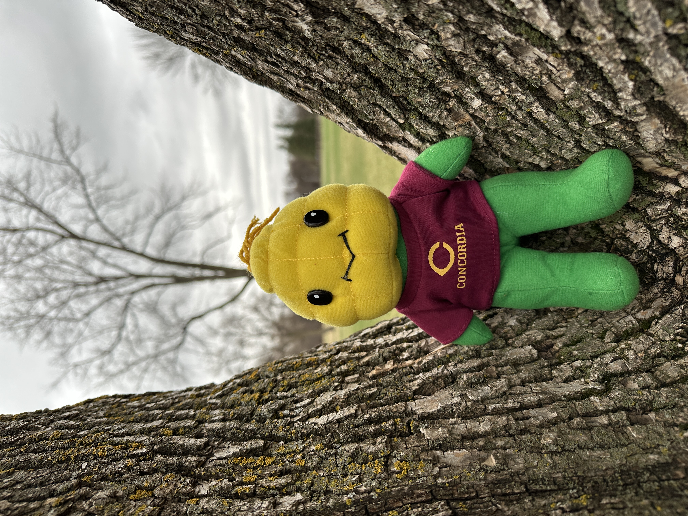
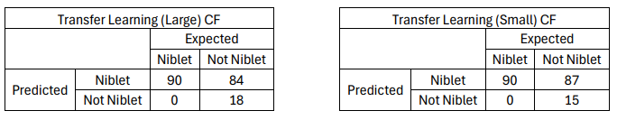
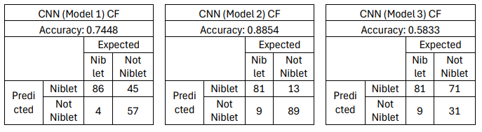
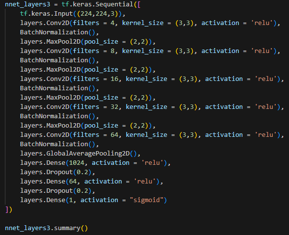

# NibletImageProcessing--CSC-380

This Python-based project utilizes TensorFlow and Keras to create Deep Learning Neural Network Models to classify images as either containing or not containing Niblet (viusalized below).

## Project Summary

I analyzed the difference in the performance of different Transfer Learning Models and Convoluted Neural Network (CNN) Models. I created confusion matrices and calculated accuracy percentages for each model. I discovered that CNNs worked better for this task, outperforming Transfer Learning Models drastically, and my second CNN model, using normalization layers after each convolution and pooling, netted the highest accuracy percentage.

Date: April 2024

Member: Riley Fiske
